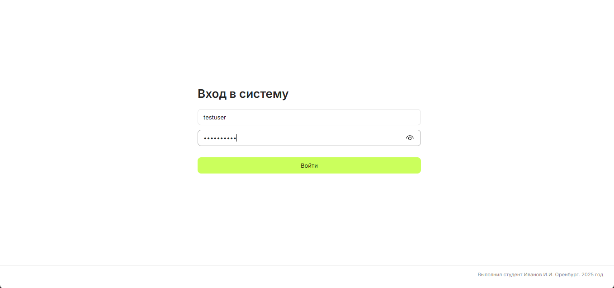
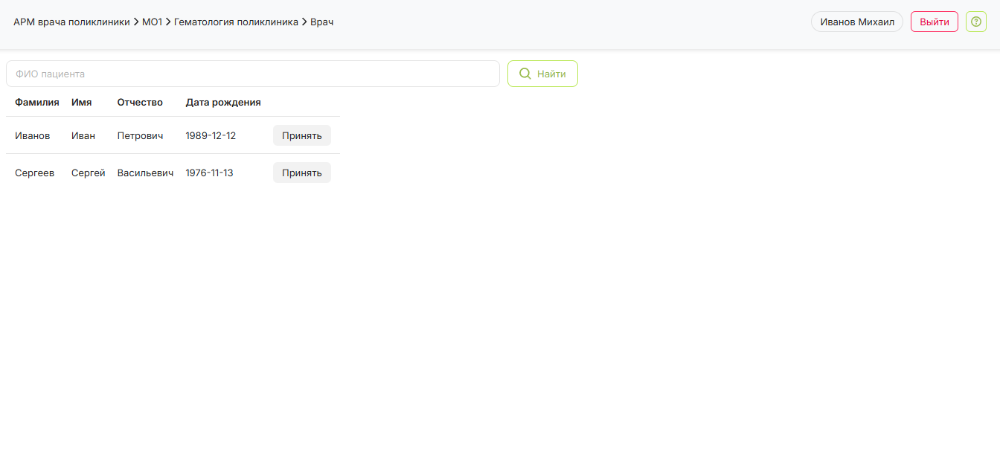
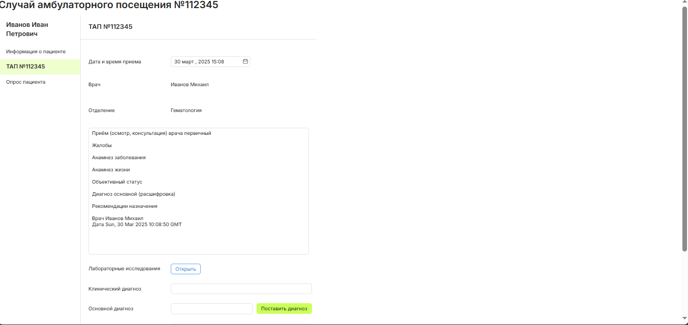

# Установка 
Запуситить Django сервер
```
python -m venv .venv
source .venv/bin/activate 
pip install -r requirements.txt
python backend/manage.py runserver 
```

Запустить frontend в другом терминале 
```
cd frontend 
npm install 
npm run dev 
```

Перейти на страницу 

<http://localhost:5173>

# Скриншоты

## Логин


## Главная страница


## Страница пациента
